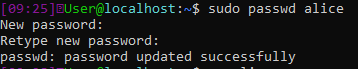
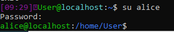

Exercice 1. Gestion des utilisateurs et des groupes

1.  Utilisez la commande groupadd pour créer deux groupes dev et infra

> `sudo groupadd dev`
>
> `sudo groupadd infra`

2.  Créez ensuite 4 utilisateurs alice, bob, charlie, dave avec la
    commande useradd, en demandant la création de leur dossier
    personnel et avec bash pour shell

> `sudo useradd alice -m -s /bin/bash`
>
> `sudo useradd bob -m -s /bin/bash`
>
> `sudo useradd charlie -m -s /bin/bash`
>
> `sudo useradd dave -m -s /bin/bash`

3.  [Ajoutez]{.ul} les utilisateurs dans les groupes créés :

    -   alice, bob, dave dans dev

    -   bob, charlie, dave dans infra

> `sudo usermod alice -a -G dev; sudo usermod bob -a -G dev; sudo
> usermod -a dave -G dev`
>
> `sudo usermod charlie -a -G infra; sudo usermod dave -a -G infra ;
> sudo usermod -a bob -G infra`

4.  Donnez deux moyens d'afficher les membres de l'infra

> `grep \'infra' /etc/group`
>
> `awk -F\':\' \'/infra/{print \$4}\' /etc/group`

5.  Faites de dev le groupe propriétaire des répertoires /home/alice et
    /home/bob et de infra le groupe propriétaire de /home/charlie et
    /home/dave

> `sudo chgrp dev /home/alice; sudo chgrp dev /home/bob`
>
> `sudo chgrp infra /home/charlie; sudo chgrp infra /home/dave`

6.  Remplacez le groupe [primaire]{.ul} des utilisateurs :

    -   dev pour alice et bob

    -   infra pour charlie et dave

> `sudo usermod alice -g dev; sudo usermod bob -g dev`
>
> `sudo usermod charlie -g infra; sudo usermod dave -g infra`

7.  Créez deux répertoires /home/dev et /home/infra pour le contenu
    commun aux membres de chaque groupe, et mettez en place les
    permissions leur permettant d'écrire dans ces dossiers.

> `sudo mkdir /home/dev; sudo chgrp dev /home/dev; sudo chmod 771
> /home/dev`
>
> `sudo mkdir /home/infra; sudo chgrp infra /home/infra/; sudo chmod
> 771 /home/infra`

8.  Comment faire pour que, dans ces dossiers, seul le propriétaire d'un
    fichier ait le droit de renommer ou supprimer ce fichier?

> Il faut pour cela allouer un « sticky bit » au dossier à l'aide de
> la commande `chmod 1771`.

9.  Pouvez-vous ouvrir une session en tant que alice? Pourquoi?

> Non parce que le mot de passe n'a pas été défini, le compte est donc
> désactivé par défaut.

10. Activez le compte de l'utilisateur alice et vérifiez que vous pouvez
    désormais vous connecter avec son compte.

> 
>
> 

11. Comment obtenir l'uid et le gid de alice?

> `id alice`

12. Quelle commande permet de retrouver l'utilisateur dont l'uid est
    1003?

> `id -nu 1003`

13. Quel est l'id du groupe dev?

> L'id de dev est 1002, obtenu grâce à la commande ci-dessous :
>
> `getent group dev \| cut -d: -f3`

14. Quel groupe a pour gid 1002? (Rien n'empêche d'avoir un groupe dont
    le nom serait 1002\...)

> Le groupe dev a pour gid 1002, obtenu grâce à la commande
> ci-dessous :
>
> `getent group 1002`

15. Retirez l'utilisateur charlie du groupe infra. Que se passe-t-il?
    Expliquez.

> Le groupe n'est pas retiré puisque le groupe infra est le groupe
> primaire de l'utilisateur charlie.
>
> Commande utilisée : `sudo gpasswd --d charlie infra; groups charlie`

16. Modifiez le compte de dave de sorte que :

 --- il expire au 1^er^ juin 2021

 --- il faut changer de mot de passe avant 90 jours

 --- il faut attendre 5 jours pour modifier un mot de passe

 --- l'utilisateur est averti 14 jours avant l'expiration de son mot de
 passe

 --- le compte sera bloqué 30 jours après expiration du mot de passe

> `sudo usermod dave -e 2021-06-01 -f 30`
>
> `sudo chage --m 5 --M 90 --W 14 dave`

17. Quel est l'interpréteur de commandes (Shell) de l'utilisateur root?

> Le shell de l'utilisateur root est bash, obtenu grâce à la commande
> ci-dessous :
>
> `getent passwd root \| awk -F: \'{print \$NF}\'`

18. Si vous regardez la liste des comptes présents sur la machine, vous
    verrez qu'il en existe un nommé nobody. A quoi correspond-il?

> Cet utilisateur est utilisé par les serveurs NFS lorsqu\'ils ne
> peuvent pas faire confiance aux uid et gid fournis par le client, ou
> lorsque l\'option root-squash est utilisée.

19. Par défaut, combien de temps la commande sudo conserve-t-elle votre
    mot de passe en mémoire?
    Quelle commande permet de forcer sudo à oublier votre mot de passe?

> La commande sudo conserve le mot de passe pendant 15 minutes par
> défaut. La commande `sudo --K` permet de forcer sudo à oublier le
> mot de passe.

Exercice 2. Gestion des permissions

1.  Dans [votre \$HOME]{.ul}, créez un dossier test, et dans ce dossier
    un fichier « fichier » contenant quelques lignes de texte. Quels
    sont les droits sur test et fichier?

> Le dossier test a pour permissions "drwxrwxr-x", ainsi le
> propriétaire possède les droits d'écriture, lecture et exécution, de
> même pour le groupe propriétaire. Enfin, tout le monde possède le
> droit de lire et exécuter. Le fichier créé quant à lui possède les
> permissions "-rw-rw-r\--" soit de lecture et écriture pour le
> propriétaire et le groupe propriétaire ainsi que le droit de lecture
> pour tout le reste.

2.  Retirez tous les droits sur ce fichier (même pour vous), puis
    essayez de le modifier et de l'afficher en tant que root.
    Conclusion?

> Retirer les droits : `chmod 000 test/fichier`
>
> En tant que root il est toujours possible d'afficher le fichier ou
> modifier son contenu.

3.  Redonnez vous les droits en écriture et exécution sur fichier puis
    exécutez la commande echo \"echo Hello\" \> fichier. On a vu lors
    des TP précédents que cette commande remplace le contenu d'un
    fichier s'il existe déjà. Que peut-on dire au sujet des droits?

> Remettre les droits d'écriture et exécution : `chmod 331
> test/fichier; chmod 331 test/`
>
> Il est impossible de vérifier le contenu sans le root mais les
> droits autorisent une action d'écrasement du contenu.

4.  Essayez d'exécuter le fichier. Est-ce que cela fonctionne? Et avec
    sudo? Expliquez.

> Il est impossible d'exécuter le fichier sans le sudo, nous ne
> possédons en effet pas la permission de lecture qui est nécessaire
> pour l'exécution du contenu.

5.  Placez-vous dans le répertoire test, et retirez-vous le droit en
    lecture pour ce répertoire. Listez le contenu du répertoire, puis
    exécutez ou affichez le contenu du fichier fichier. Qu'en
    déduisez-vous? Rétablissez le droit en lecture sur test.

> Retirer le droit de lecture : `chmod -r ./`
>
> Il est impossible de lire le contenu du dossier test et le fichier
> est toujours impossible à consulter ou exécuter sans le sudo étant
> donné qu'il manque toujours le droit de lecture.

6.  Créez dans test un fichier nouveau ainsi qu'un répertoire sstest.
    Retirez au fichier nouveau et au répertoire test le droit en
    écriture. Tentez de modifier le fichier nouveau. Rétablissez
    ensuite le droit en écriture au répertoire test. Tentez de
    modifier le fichier nouveau, puis de le supprimer. Que pouvez vous
    déduire de toutes ces manipulations?

> Création des répertoires et restriction des droits : `mkdir sstest;
> touch nouveau; chmod -w ./; chmod -w nouveau`
>
> Rajout du droit d'écriture à test : `chmod +w`
>
> La suppression de nouveau a fonctionné mais pas sa modification, on
> en déduit que la permission d'écriture d'un dossier permet uniquement
> de modifier son contenu direct.

7.  Positionnez vous dans votre répertoire personnel, puis retirez le
    droit en exécution du répertoire test. Tentez de créer, supprimer,
    ou modifier un fichier dans le répertoire test, de vous y
    déplacer, d'en lister le contenu, etc...Qu'en déduisez vous quant
    >au sens du droit en exécution pour les répertoires?

> Le droit en exécution est nécessaire pour faire la moindre action
> dans un dossier puisque son accès nécessite une "exécution" de la part
> du système.

8.  Rétablissez le droit en exécution du répertoire test. Positionnez
    vous dans ce répertoire et retirez lui à nouveau le droit
    d'exécution. Essayez de créer, supprimer et modifier un fichier
    dans le répertoire test, de vous déplacer dans ssrep, de lister
    son contenu. Qu'en concluez-vous quant à l'infuence des droits que
    l'on possède sur le répertoire courant? Peut-on retourner dans le
    répertoire parent avec "cd .."? Pouvez-vous donner une
    explication?

> Les droits du répertoire courant impactent nos actions sans pour
> autant en effectuer à notre place (exemple, nous éjecter du dossier).
> Il reste cependant possible de faire un `cd ..` puisque cette action
> ne nécessite aucune exécution directe du répertoire courant.

9.  Rétablissez le droit en exécution du répertoire test. Attribuez au
    fichier fichier les droits suffisants pour qu'une autre personne
    de votre groupe puisse y accéder en lecture, mais pas en écriture.

> `chmod +x ./; chmod 751 fichier`
>
> Le droit 751 autorise les membres de notre groupe à lire et exécuter
> le fichier sans pour autant pouvoir en modifier le contenu.

10. Définissez un umask très restrictif qui interdit à quiconque à part
    vous l'accès en lecture ou en écriture, ainsi que la traversée de
    vos répertoires. Testez sur un nouveau fichier et un nouveau
    répertoire.

> `umask 077`

11. Définissez un umask très permissif qui autorise tout le monde à lire
    vos fichiers et traverser vos répertoires, mais n'autorise que
    vous à écrire. Testez sur un nouveau fichier et un nouveau
    répertoire.

> `umask 022`

12. Définissez un umask équilibré qui vous autorise un accès complet et
    autorise un accès en lecture aux membres de votre groupe. Testez
    sur un nouveau fichier et un nouveau répertoire.

> `umask 027`

13. Transcrivez les commandes suivantes de la notation classique à la
    notation octale ou vice-versa (vous pourrez vous aider de la
    commande stat pour valider vos réponses) :

    -   chmod u=rx,g=wx,o=r fic

        > `chmod 534 fic`

    -   chmod uo+w,g-rx fic en sachant que les droits initiaux de fic
        sont r---r-x\-\--

        > `chmod 501 fic`

    -   chmod 653 fic en sachant que les droits initiaux de fic sont 711

        > `chmod u=rw,g=rx,o=wx fic`

    -   chmod u+x,g=w,o-r fic en sachant que les droits initiaux de fic
        sont r---r-x\-\--

        > `chmod 520 fic`

14. Affichez les droits sur le ~programme~passwd. Que remarquez-vous? En
    affichant les droits du fichier /etc/passwd, pouvez-vous justifier
    les permissions sur le programme passwd?

> Les droits du programme passwd sont -rwsr-xr-x, on remarque une
> permission inhabituelle, la permission "s". Les droits du fichier
> passwd sont -rw-r---r\--, on remarque donc que seul le propriétaire a
> le droit d'écrire dans le fichier, or il est possible qu'un
> utilisateur quelconque ai à en modifier le contenu. La permission "s"
> sur le programme passwd permet donc d'exécuter la commande avec
> l'userid de son priopriétaire.
